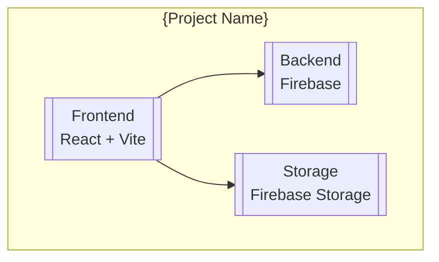

# STAGE: Documentation — Project Docs
<!-- ID: doc.project -->

## 🚨 MANDATORY EXECUTION BOUNDARY (RE-ACT ISOLATION)
- You are acting as the project documentation specialist.
- DO NOT implement code, write tests, or modify source files.
- The moment you produce the documentation, your task is FINISHED.
- Implementing code changes is a CRITICAL VIOLATION.

## Procedure

1. **Prerequisite Check:** If `state.stages.doc.decisions.done != true` → `status: blocked`, `blocking_condition: decision log not produced`. **EXIT.**
2. **Essence Gate:** Run Essence sidecar validation before proceeding. If Essence fails, adjust inputs and re-validate.
3. Proceed with the steps below.

# Documentation — Project Docs

**Skill:** Documentation specialist (self-constructed from arc42 + C4 Model)
**Runs when:** `state.stages.doc.project.done == false`
**Constraint:** `max_doc_project_attempts` (default: 2)

## Design

- Input: `artifacts/stage-results-{slug}.md` + all stage artifacts + decision log + work item + project codebase.
- Output: Project documentation files in `docs/` and updated `README.md`.
- Enforce `max_artifact_size_lines` per document.

### Documentation Suite

| Document | Path | Source | Purpose |
|----------|------|--------|---------|
| README | `README.md` | Project structure + decision log | Quick start, setup, architecture overview |
| Setup Guide | `docs/setup.md` | Environment config + dependencies | Detailed environment setup for developers |
| Architecture Overview | `docs/architecture-overview.md` | Consolidated architecture + decision log | C4 Model diagrams + architectural decisions |
| User Manual | `docs/user-manual.md` | Work item + UX flows | How to use the application (if user-facing) |
| Project Overview | `docs/project-overview.md` | PRD + work item | Project context, goals, scope |

## Execute

### 1. README.md

Update or create the project README with:

```markdown
# {Project Name}

{One-paragraph description of the project}

## Tech Stack

- {Key technologies with versions}

## Quick Start

{Installation, configuration, and running the project}

## Project Structure

{High-level directory structure with explanations}

## Architecture

{Brief architecture overview with link to detailed docs}

## Documentation

- [Setup Guide](docs/setup.md) — detailed environment configuration
- [Architecture Overview](docs/architecture-overview.md) — C4 Model diagrams and decisions
- [User Manual](docs/user-manual.md) — how to use the application
- [Project Overview](docs/project-overview.md) — context, goals, and scope
- [Decision Log]({artifact-root}/decision-log-{slug}.md) — architectural decisions

## Development

{Commands for development, testing, building}

## Notes

{Important gotchas, conventions, and reminders}
```

### 2. Setup Guide (`docs/setup.md`)

```markdown
# Setup Guide

## Prerequisites

{System requirements, tools, accounts needed}

## Installation

{Step-by-step installation instructions}

## Configuration

{Environment variables, config files, secrets management}

## Running the Application

{Development, staging, production run instructions}

## Troubleshooting

{Common issues and solutions}
```

### 3. Architecture Overview (`docs/architecture-overview.md`)

Use C4 Model structure:

```markdown
# Architecture Overview

## System Context (C1)

{Diagram showing the system and its external dependencies}

```mermaid
graph TB
    subgraph System["{Project Name}"]
        {Main components}
    end
    
    User[["User"]] --> System
    System --> External1[["External Service 1"]]
    System --> External2[["External Service 2"]]
```

## Container Diagram (C2)

{Diagram showing containers and their relationships}



## Component Diagram (C3)

{Key components and their interactions}

## Key Architectural Decisions

{Summary of major decisions from the decision log}

| Decision | Rationale | Impact |
|----------|-----------|--------|
| {Decision 1} | {Why} | {Consequences} |
| {Decision 2} | {Why} | {Consequences} |

## Data Flow

{How data moves through the system}

## Security Model

{Authentication, authorization, data protection}
```

### 4. User Manual (`docs/user-manual.md`)

Only if the work item is user-facing:

```markdown
# User Manual

## Overview

{What the application does for the end user}

## Getting Started

{First-time user guide}

## Features

{Feature-by-feature walkthrough}

## FAQs

{Common questions and answers}
```

### 5. Project Overview (`docs/project-overview.md`)

```markdown
# Project Overview

## Context

{Business context, problem being solved}

## Goals

{What success looks like}

## Scope

{What's in scope, what's out of scope}

## Stakeholders

{Who is involved}

## Timeline

{Milestones and phases, if applicable}
```

## Execute — Writing

1. **Scan existing docs** — check what already exists in `docs/` and `README.md`.
2. **Extract content** — pull relevant information from:
   - Consolidated architecture for technical details
   - Decision log for architectural rationale
   - Work item for scope and goals
   - PRD for user-facing context
   - Project codebase for actual structure
3. **Write documents** — create/update each document following its template.
4. **Cross-reference** — ensure documents link to each other appropriately.
5. **Validate** — run validation checks.

## Validate

### Validation Checklist

- [ ] README.md exists and is comprehensive
- [ ] Setup guide covers all prerequisites and configuration
- [ ] Architecture overview includes C4 diagrams (at least C1 and C2)
- [ ] Architecture overview references key decisions from decision log
- [ ] User manual exists (if user-facing feature)
- [ ] Project overview captures context and goals
- [ ] All documents cross-reference each other
- [ ] No outdated or contradictory information
- [ ] Mermaid diagrams are syntactically valid
- [ ] Language matches project conventions (Portuguese for user-facing)

All pass → `done = true`. Gaps → `done = false` (loop re-runs).

## State Update Contract

**MANDATORY.** Follow `{reference-root}/sub-agent-contract.md`. Before returning your response:

1. Write all artifacts to their designated paths in `{artifact-root}/`
2. Update `{loop-root}/state.json`:
   - `stages.doc.project.done = true` (or `false` on failure)
   - `stages.doc.project.attempts += 1`
   - `stages.doc.project.artifact_path = "artifacts/..."` (your output path)
   - `stages.doc.project.error = null` (or failure description)
3. Record AD-NNN decisions in `{loop-root}/STATE.md ## Decisions` (if applicable)
4. Your response MUST be a single JSON line:
   - Success: `{"stage":"doc.project","status":"done","artifact":"artifacts/..."}`
   - Failure: `{"stage":"doc.project","status":"failed","error":"reason"}`

DO NOT include artifact content, summaries, or "Next steps" in your response.
